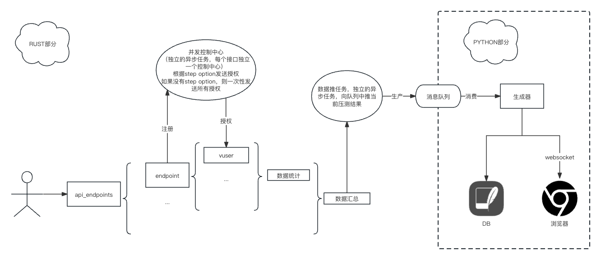

# atomic-bomb-engine-py
#### [atomic-bomb-engine](https://github.com/we-lsp/atomic-bomb-engine)的python包装实现


## 前端仓库
#### [atomic-bomb-engine-front](https://github.com/GiantAxeWhy/atomic-bomb-engine-front)

## 使用条件：
- python版本 >= 3.8
- windows(x86), linux(x86), mac

## 使用方法：
- ### 准备开始
通过pip安装 （0.5.0版本之前）
```shell
pip install atomic-bomb-engine-py
```
在python中引用时注意，需要引用atomic_bomb_engine, 而不是atomic_bomb_engine_py
<br/> 为了避免混淆，0.5.0版本之后，pip更换了包名，更改为atomic-bomb-engine，
```shell
pip install atomic-bomb-engine
```
在python中导入
```python
import atomic_bomb_engine
```
异步使用的时候，还需要引用asyncio
```python
import asyncio
```
- ### 开始压测
  - ~~单接口压测~~ （功能与多接口压测重叠，已废除）

  - 多接口压测

多接口压测可以使用batch_async方法进行操作，函数签名和解释如下
 ```python
async def batch_async(
        test_duration_secs: int,
        concurrent_requests: int,
        api_endpoints:List[Dict],
        step_option:Dict[str, int]=None,
        verbose:bool=False,
        should_prevent:bool=False) ->Dict:
  """
      批量压测
      :param test_duration_secs: 测试持续时间
      :param concurrent_requests: 并发数
      :param api_endpoints: 接口信息
      :param step_option: 阶梯加压选项
      :param verbose: 打印详细信息
      :param should_prevent: 是否禁用睡眠
  """

 ```

使用assert_option方法可以返回断言选项字典
```python
assert_options=[
atomic_bomb_engine.assert_option("$.code", 429),
atomic_bomb_engine.assert_option("$.code", 200)
])
```
jsonpath如果不会用的话，建议去[jsonpath](https://jsonpath.com/)学习

使用step_option方法可以返回阶梯加压选项字典
```python
def step_option(increase_step: int, increase_interval: int) -> Dict[str, int]:
    """
    生成step option
    :param increase_step: 阶梯步长
    :param increase_interval: 阶梯间隔
    """
```

同样的本包中也包含了一个对api_endpoint的包装：endpoint方法，方便调用，endpoint中的assert_options中也可以套用assert_option方法
 ```python
    async def run_batch():
        result = await atomic_bomb_engine.batch_async(
            test_duration_secs=10,
            concurrent_requests=10,
            api_endpoints=[
                atomic_bomb_engine.endpoint(
                    name="test1",
                    url="https:xxxxx1.xx",
                    method="get",
                    weight=1,
                    timeout_secs=10,
                    assert_options=[atomic_bomb_engine.assert_option(jsonpath="$.code", reference_object=200)]
                ),
                atomic_bomb_engine.endpoint(
                    name="test2",
                    url="https://xxxxx2.xx",
                    method="get",
                    weight=1,
                    timeout_secs=10)
            ])
        print(result)
 ```
    
监听时可以使用BatchListenIter生成器
```python
async def listen_batch():
    iterator = atomic_bomb_engine.BatchListenIter()
    for message in iterator:
        if message:
            print(message)
        else:
            await asyncio.sleep(0.3)
```
压测+同时监听
```python 
async def main():
    await asyncio.gather(
        run_batch(),
        listen_batch(),
    )


if __name__ == "__main__":
    asyncio.run(main())
```

# 压测时使用ui界面监控

0.5.0版本后，添加了ui页面，支持批量压测方法
<br/>导入
```python
from atomic_bomb_engine import server
```
使用
```python
import asyncio

import atomic_bomb_engine
from atomic_bomb_engine import server


@server.ui(port=8000)
async def run_batch():
    result = await atomic_bomb_engine.batch_async(
        test_duration_secs=120,
        concurrent_requests=100,
        verbose=False,
        api_endpoints=[
            atomic_bomb_engine.endpoint(name="test-baidu",url="https://baidu.com",method="GET",weight=1,timeout_secs=10),
            atomic_bomb_engine.endpoint(name="test-google", url="https://google.com", method="GET", weight=1, timeout_secs=10),
        ])
    print(result)
    return result


if __name__ == '__main__':
    asyncio.run(run_batch())
```

使用server.ui装饰器，可以给批量压测方法启动一个简单的web服务器，不需要再手动监听BatchListenIter生成器

## 内部架构图


## [0.19.0] - 2024-04-16
### Added
- 增加了初始化和参数模版功能
```python
setup_options=[
            atomic_bomb_engine.setup_option(
                name="初始化-1",
                url="https://xxx.xxx/api/short/v1/list",
                method="get",
                timeout_secs=10,
                jsonpath_extract=[
                    atomic_bomb_engine.jsonpath_extract_option(key="test-msg", jsonpath="$.msg"),
                    atomic_bomb_engine.jsonpath_extract_option(key="test-code", jsonpath="$.code"),
                ]
            )],
```
上述实例展示了如何在初始化的时候调用某个接口，并且通过jsonpath将数据提取出来，保存在全局变量test-msg和test-code中
提取完全局变量后，就可以在后续的api_endpoints中使用
```python
api_endpoints=[
        atomic_bomb_engine.endpoint(
            name="test-1",
            url="http://127.0.0.1:8000/a",
            method="POST",
            weight=1,
            timeout_secs=10,
            json={"name": "{{test-msg}}", "number": "{{test-code}}"},
        ),
    ]
```
上述实例展示了如何在请求中使用全局变量，使用双大括号即可使用

### Fixed
- 修复了如果http状态码错误时，不会记录
- 修复了json反序列化的问题

## [0.20.0] - 2024-04-17
### Added
断言更改为异步生产消费，提升性能

## bug和需求
- 如果发现了bug，把复现步骤一起写到Issus中哈
- 如果有需求也可以在Issues中讨论
- 本程序是本人业余时间开发，不太准备保证时效性，但是如果有时间，一定第一时间回复和修改bug

## [0.22.0] - 2024-04-18
### Added
前端进行了性能优化

## [0.24.0] - 2024-04-22
### Added
异步断言使用了补偿消息，保证消息的一致性

## [0.25.0] - 2024-04-23
### Added
在endpoints中增加思考时间,模拟用户行为
```python
think_time_option(min_millis=200, max_millis=300)
```
  - min_millis:最小思考时间(毫秒)
  - max_millis:最大思考时间(毫秒)

使用时在endpoint中增加think_time_option参数

```python
api_endpoints=[
  atomic_bomb_engine.endpoint(
    name="test-1",
    url="http://127.0.0.1:8000/a",
    method="POST",
    weight=1,
    timeout_secs=10,
    json={"name": "{{test-msg}}", "number": "{{test-code}}"},
    think_time_option=atomic_bomb_engine.think_time_option(min_millis=200, max_millis=300),
  ),
]
```

## bug和需求
- 如果发现了bug，把复现步骤一起写到Issus中哈
- 如果有需求也可以在Issues中讨论
- 本程序是本人业余时间开发，不太准备保证时效性，但是如果有时间，一定第一时间回复和修改bug

## TODO
- [x] 前端展示页面 ✅
- [x] 接口关联 ✅
- [x] 每个接口可以配置思考时间 ✅
- [x] 增加form支持 ✅
- [ ] 增加附件支持
- [ ] 断言支持不等于等更多表达方式

## 联系方式
- 邮箱:[qyzhg@qyzhg.com](mailto:qyzhg@qyzhg.com)
- 微信:qy-zhg

## 👏🏻👏🏻👏🏻欢迎加群交流

