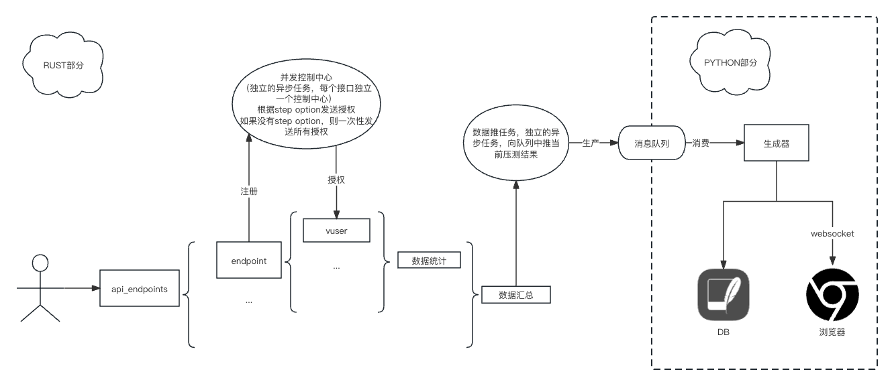

# atomic-bomb-engine-py
#### [atomic-bomb-engine](https://github.com/we-lsp/atomic-bomb-engine)的python包装实现


## 前端仓库
#### [atomic-bomb-engine-front](https://github.com/GiantAxeWhy/atomic-bomb-engine-front)

## 使用条件：
- python版本 >= 3.8（已验证 3.8 - 3.13）
- windows(x86), linux(x86), mac

## 使用方法：
- ### 准备开始
通过pip安装 （0.5.0版本之前）
```shell
pip install atomic-bomb-engine-py
```
在python中引用时注意，需要引用atomic_bomb_engine, 而不是atomic_bomb_engine_py
<br/> 为了避免混淆，0.5.0版本之后，pip更换了包名，更改为atomic-bomb-engine，
```shell
pip install atomic-bomb-engine
```
在python中导入
```python
import atomic_bomb_engine
```
异步使用的时候，还需要引用asyncio
```python
import asyncio
```
- ### 开始压测
  - ~~单接口压测~~ （功能与多接口压测重叠，已废除）

  - 多接口压测

多接口压测可以先使用
```python 
runner = atomic_bomb_engine.BatchRunner()
```
实例化一个runner类
通过runner类中的run方法开启压测
run方法函数签名如下
```python
def run(
         self,
         test_duration_secs: int,
         concurrent_requests: int,
         api_endpoints:List[Dict],
         step_option:Dict[str, int]|None=None,
         setup_options:List[Dict[str, Any]]|None=None,
         verbose:bool=False,
         should_prevent:bool=False,
         assert_channel_buffer_size:int=1024,
         timeout_secs=0,
         cookie_store_enable=True
    ) -> None:
        """
            批量压测
            :param test_duration_secs: 测试持续时间
            :param concurrent_requests: 并发数
            :param api_endpoints: 接口信息
            :param step_option: 阶梯加压选项
            :param setup_options: 初始化选项
            :param verbose: 打印详细信息
            :param should_prevent: 是否禁用睡眠
            :param assert_channel_buffer_size: 断言队列buffer大小
            :param timeout_secs: http超时时间
            :param cookie_store_enable: 是否为客户端启用持久性cookie存储。
        """
```

使用assert_option方法可以返回断言选项字典
```python
assert_options=[
atomic_bomb_engine.assert_option("$.code", 429),
atomic_bomb_engine.assert_option("$.code", 200)
])
```
jsonpath如果不会用的话，建议去[jsonpath](https://jsonpath.com/)学习

使用step_option方法可以返回阶梯加压选项字典
```python
def step_option(increase_step: int, increase_interval: int) -> Dict[str, int]:
    """
    生成step option
    :param increase_step: 阶梯步长
    :param increase_interval: 阶梯间隔
    """
```

同样的本包中也包含了一个对api_endpoint的包装：endpoint方法，方便调用，endpoint中的assert_options中也可以套用assert_option方法
 ```python
async def run_batch():
  result = await atomic_bomb_engine.batch_async(
    # 测试持续时间
    test_duration_secs=60,
    # 并发量
    concurrent_requests=200,
    # 阶梯设置（每5秒增加30个并发）
    step_option=atomic_bomb_engine.step_option(increase_step=30, increase_interval=5),
    # 接口超时时间
    timeout_secs=10,
    # 是否开启客户端启用持久性cookie存储
    cookie_store_enable=True,
    # 全局初始化
    setup_options=[
      atomic_bomb_engine.setup_option(
        name="初始化-1",
        url="http://localhost:8080/setup",
        method="get",
        jsonpath_extract=[
          atomic_bomb_engine.jsonpath_extract_option(key="test-msg", jsonpath="$.msg"),
          atomic_bomb_engine.jsonpath_extract_option(key="test-code", jsonpath="$.code"),
        ]
      )],
    # 是否开启详细日志
    verbose=False,
    # 被压接口设置
    api_endpoints=[
      atomic_bomb_engine.endpoint(
        # 接口任务命名
        name="test-1",
        # 针对每个接口初始化
        setup_options=[
          atomic_bomb_engine.setup_option(
            name="api-初始化-1",
            url="http://localhost:8080/api_setup",
            method="get",
            jsonpath_extract=[
              atomic_bomb_engine.jsonpath_extract_option(key="api-test-msg-1", jsonpath="$.msg"),
              atomic_bomb_engine.jsonpath_extract_option(key="api-test-code-1", jsonpath="$.code"),
            ]
          )
        ],
        # 被压接口url
        url="http://localhost:8080/direct",
        # 请求方式
        method="POST",
        # 权重
        weight=1,
        # 发送json请求
        json={"name": "{{api-test-msg-1}}", "number": 1},
        # 断言选项
        assert_options=[
          atomic_bomb_engine.assert_option(jsonpath="$.number", reference_object=1),
        ],
        # 思考时间选项（在最大和最小之间随机，单位毫秒）
        think_time_option=atomic_bomb_engine.think_time_option(min_millis=500, max_millis=1200),
      ),
    ])
  print(result)
  return result
 ```
    
监听时可以在使用完run方法后，继续迭代runner即可

压测+同时监听

```python 
import asyncio


async def batch_async():
  runner = atomic_bomb_engine.BatchRunner()
  runner.run(
    test_duration_secs=30,
    concurrent_requests=30,
    step_option=atomic_bomb_engine.step_option(increase_step=3, increase_interval=3),
    timeout_secs=15,
    cookie_store_enable=True,
    verbose=False,
    api_endpoints=[
      atomic_bomb_engine.endpoint(
        name="test-1",
        url="http://127.0.0.1:8080/direct",
        method="POST",
        json={"name": "test-1", "number": 1},
        weight=100,
        assert_options=[
          atomic_bomb_engine.assert_option(jsonpath="$.msg", reference_object="操作成功"),
        ],
      ),
    ])
  return runner


async def main():
  results = await batch_async()
  for res in results:
    if res.get("should_wait"):
      await asyncio.sleep(0.1)
    print(res)


if __name__ == '__main__':
  asyncio.run(main())
```

# 压测时使用ui界面监控

0.5.0版本后，添加了ui页面，支持批量压测方法
<br/>导入
```python
from atomic_bomb_engine import server
```
使用
```python
import asyncio

import atomic_bomb_engine
from atomic_bomb_engine import server


@server.ui(port=8000)
async def batch_async():
    runner = atomic_bomb_engine.BatchRunner()
    runner.run(
      # 测试持续时间
      test_duration_secs=60,
      # 并发量
      concurrent_requests=200,
      # 阶梯设置（每5秒增加30个并发）
      step_option=atomic_bomb_engine.step_option(increase_step=30, increase_interval=5),
      # 接口超时时间
      timeout_secs=10,
      # 是否开启客户端启用持久性cookie存储
      cookie_store_enable=True,
      # 全局初始化
      setup_options=[
        atomic_bomb_engine.setup_option(
          name="初始化-1",
          url="http://localhost:8080/setup",
          method="get",
          jsonpath_extract=[
            atomic_bomb_engine.jsonpath_extract_option(key="test-msg", jsonpath="$.msg"),
            atomic_bomb_engine.jsonpath_extract_option(key="test-code", jsonpath="$.code"),
          ]
        )],
      # 是否开启详细日志
      verbose=False,
      # 被压接口设置
      api_endpoints=[
        atomic_bomb_engine.endpoint(
          # 接口任务命名
          name="test-1",
          # 针对每个接口初始化
          setup_options=[
            atomic_bomb_engine.setup_option(
              name="api-初始化-1",
              url="http://localhost:8080/api_setup",
              method="get",
              jsonpath_extract=[
                atomic_bomb_engine.jsonpath_extract_option(key="api-test-msg-1", jsonpath="$.msg"),
                atomic_bomb_engine.jsonpath_extract_option(key="api-test-code-1", jsonpath="$.code"),
              ]
            )
          ],
          # 被压接口url
          url="http://localhost:8080/direct",
          # 请求方式
          method="POST",
          # 权重
          weight=1,
          # 发送json请求
          json={"name": "{{api-test-msg-1}}", "number": 1},
          # 断言选项
          assert_options=[
            atomic_bomb_engine.assert_option(jsonpath="$.number", reference_object=1),
          ],
          # 思考时间选项（在最大和最小之间随机，单位毫秒）
          think_time_option=atomic_bomb_engine.think_time_option(min_millis=500, max_millis=1200),
        ),
      ])
    return runner


if __name__ == '__main__':
    asyncio.run(batch_async())
```

使用server.ui装饰器，可以给批量压测方法启动一个简单的web服务器，不需要再手动监听BatchListenIter生成器

## 内部架构图


## [0.19.0] - 2024-04-16
### Added
- 增加了初始化和参数模版功能
```python
setup_options=[
  atomic_bomb_engine.setup_option(
    name="初始化-1",
    url="http://localhost:8080/setup",
    method="get",
    jsonpath_extract=[
      atomic_bomb_engine.jsonpath_extract_option(key="test-msg", jsonpath="$.msg"),
      atomic_bomb_engine.jsonpath_extract_option(key="test-code", jsonpath="$.code"),
    ]
  )]
```
上述实例展示了如何在初始化的时候调用某个接口，并且通过jsonpath将数据提取出来，保存在全局变量test-msg和test-code中
提取完全局变量后，就可以在后续的api_endpoints中使用
```python
api_endpoints=[
  atomic_bomb_engine.endpoint(
    # 接口任务命名
    name="test-1",
    # 针对每个接口初始化
    setup_options=[
      atomic_bomb_engine.setup_option(
        name="api-初始化-1",
        url="http://localhost:8080/api_setup",
        method="get",
        jsonpath_extract=[
          atomic_bomb_engine.jsonpath_extract_option(key="api-test-msg-1", jsonpath="$.msg"),
          atomic_bomb_engine.jsonpath_extract_option(key="api-test-code-1", jsonpath="$.code"),
        ]
      )
    ],
    # 被压接口url
    url="http://localhost:8080/direct",
    # 请求方式
    method="POST",
    # 权重
    weight=1,
    # 发送json请求
    json={"name": "{{api-test-msg-1}}", "number": 1},
    # 断言选项
    assert_options=[
      atomic_bomb_engine.assert_option(jsonpath="$.number", reference_object=1),
    ],
    # 思考时间选项（在最大和最小之间随机，单位毫秒）
    think_time_option=atomic_bomb_engine.think_time_option(min_millis=500, max_millis=1200),
  ),
]
```
上述实例展示了如何在请求中使用全局变量，使用双大括号即可使用

### Fixed
- 修复了如果http状态码错误时，不会记录
- 修复了json反序列化的问题

## [0.20.0] - 2024-04-17
### Added
断言更改为异步生产消费，提升性能

## bug和需求
- 如果发现了bug，把复现步骤一起写到Issus中哈
- 如果有需求也可以在Issues中讨论
- 本程序是本人业余时间开发，不太准备保证时效性，但是如果有时间，一定第一时间回复和修改bug

## [0.22.0] - 2024-04-18
### Added
前端进行了性能优化

## [0.24.0] - 2024-04-22
### Added
异步断言使用了补偿消息，保证消息的一致性

## [0.25.0] - 2024-04-23
### Added
在endpoints中增加思考时间,模拟用户行为
```python
think_time_option(min_millis=200, max_millis=300)
```
  - min_millis:最小思考时间(毫秒)
  - max_millis:最大思考时间(毫秒)

使用时在endpoint中增加think_time_option参数

```python
api_endpoints=[
  atomic_bomb_engine.endpoint(
    name="test-1",
    url="http://localhost:8080/a",
    method="POST",
    weight=1,
    timeout_secs=10,
    json={"name": "{{test-msg}}", "number": "{{test-code}}"},
    think_time_option=atomic_bomb_engine.think_time_option(min_millis=200, max_millis=300),
  ),
]
```

## [0.26.0] - 2024-04-24
### Added
- 增加endpoint中的setup，在并发中可以做接口断言
- 增加有关联条件下的cookie自动管理功能
```python
atomic_bomb_engine.endpoint(
  # 接口任务命名
  name="test-1",
  # 针对每个接口初始化
  setup_options=[
    atomic_bomb_engine.setup_option(
      name="api-初始化-1",
      url="http://localhost:8080/api_setup",
      method="get",
      jsonpath_extract=[
        atomic_bomb_engine.jsonpath_extract_option(key="api-test-msg-1", jsonpath="$.msg"),
        atomic_bomb_engine.jsonpath_extract_option(key="api-test-code-1", jsonpath="$.code"),
      ]
    )
  ],
  # 被压接口url
  url="http://localhost:8080/direct",
  # 请求方式
  method="POST",
  # 权重
  weight=1,
  # 发送json请求
  json={"name": "{{api-test-msg-1}}", "number": 1},
  # 断言选项
  assert_options=[
    atomic_bomb_engine.assert_option(jsonpath="$.number", reference_object=1),
  ],
  # 思考时间选项（在最大和最小之间随机，单位毫秒）
  think_time_option=atomic_bomb_engine.think_time_option(min_millis=500, max_millis=1200),
)
```
- 参数cookie_store_enable控制是否自动管理cookie，前置条件的cookie会带入到最终的压测接口中
- 在endpoint中使用setup_options可以传入多个接口，并且提取参数
- 提取到的参数如果和全局的setup的key冲突，会覆盖全局提取到的参数
- 接口中提取的参数只能在本线程（v-user）中使用
- ⚠️ 使用时注意:setup_options是顺序执行的，没有并发，但是相当于添加了think time

## [0.28.0] - 2024-04-25
### Added
- 将持久化cookie添加到全局选项中
- 复用http client
- 选择性开启断言任务
- 接口初始化时出现错误等待后重试##

## [0.29.0] - 2024-04-25
### Added
- 优化并发逻辑
- 前端更改为web worker发送心跳

## [0.38.0] - 2024-05-7
### Added
- 增加附件上传功能
  - 在初始化和每个接口中增加了multipart_options参数用于附件上传
  - 增加multipart_option方法封装附件参数
    - form_key: form表单的key
    - path: 附件路径
    - file_name: 附件名
    - mime: 附件类型 (类型可以参考[这里](https://developer.mozilla.org/zh-CN/docs/Web/HTTP/Basics_of_HTTP/MIME_types/Common_types))
```python
api_endpoints=[
            atomic_bomb_engine.endpoint(
                name="test-file",
                url="http://127.0.0.1:8888/upload",
                method="post",
                weight=100,
                multipart_options=[atomic_bomb_engine.multipart_option(form_key="file", path="./ui.py", file_name="ui.py", mime="text/plain")],
                assert_options=[
                    atomic_bomb_engine.assert_option(jsonpath="$.message", reference_object="File uploaded successfully!"),
                ],
                think_time_option=atomic_bomb_engine.think_time_option(min_millis=500, max_millis=1200),
            ),]
```

## [0.39.0] - 2024-05-15
### Added
- 启用BatchRunner类，每次执行可以返回一个迭代器
- 废除run_batch方法
- 废除ResultsIter迭代器

## [0.40.0] - 2024-05-16
### Added
- 将rps统计改为滑动窗口的形式

## [0.41.0] - 2024-05-20
### Added
- run方法增加指数滑动平均参数: ema_alpha
  - 参数为0-1之间的一个浮点数
  - 参数为0时不启用
  - 数值越大越平滑，但是失真越多
  - 建议使用0.1以下

## bug和需求
- 如果发现了bug，把复现步骤一起写到Issus中哈
- 如果有需求也可以在Issues中讨论
- 本程序是本人业余时间开发，不太准备保证时效性，但是如果有时间，一定第一时间回复和修改bug

## TODO
- [x] 前端展示页面 ✅
- [x] 接口关联 ✅
- [x] 每个接口可以配置思考时间 ✅
- [x] 增加form支持 ✅
- [ ] 增加代理支持
- [x] 增加附件支持 ✅
- [ ] 断言支持不等于等更多表达方式

## 联系方式
- 邮箱:[qyzhg@qyzhg.com](mailto:qyzhg@qyzhg.com)
- 微信:qy-zhg

## 👏🏻👏🏻👏🏻欢迎加群交流

